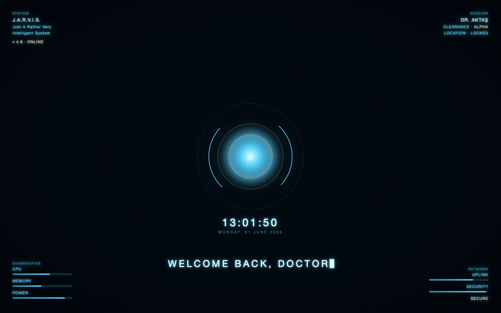

# J.A.R.V.I.S. Unlock HUD



A cinematic, Iron Man / J.A.R.V.I.S.-style greeting for macOS that fires every time
you **unlock your Mac**. A full-screen arc-reactor HUD fades in over your desktop —
spinning reactor rings, boot-up text, a live clock, and fake system telemetry — plays
an intro track, greets you in J.A.R.V.I.S.'s voice, then gracefully fades away.

> "Welcome back, Doctor. All systems online."

A tiny native Swift app listens for the screen-unlock event and overlays a transparent,
click-through `WKWebView` window running a self-contained HTML/CSS/JS HUD. No Electron,
no dependencies beyond Apple's built-in toolchain.

## ✨ Features
- 🔓 Triggers automatically on screen unlock (`com.apple.screenIsUnlocked`)
- 🌀 Animated arc-reactor HUD with boot sequence, clock & telemetry
- 🎵 Plays your own intro track, with smart **ducking** so the voice stays clear
- 🎙️ Greets you with a voice clip (or falls back to a synthesized rock riff if no audio)
- 🖥️ Multi-monitor support; click-through overlay; press `Esc` to dismiss early
- 🪶 Native, lightweight, no third-party dependencies

## 📦 Requirements
- macOS 13+ (built & tested on macOS 26, Apple Silicon)
- Xcode Command Line Tools (`xcode-select --install`) — provides `swiftc`

## 🚀 Install
```bash
git clone https://github.com/<your-username>/jarvis-unlock-hud.git
cd jarvis-unlock-hud
./install.sh
```
This compiles `JarvisHUD.app` and loads a LaunchAgent so it runs on every unlock.

Try it immediately without locking:
```bash
./JarvisHUD.app/Contents/MacOS/JarvisHUD --demo
```

## 🎵 Add your own music & voice (you provide these)
**No audio ships with this repo.** Drop your own files into `hud/` and re-run `./install.sh`:

| File | What it is | If missing |
|------|------------|------------|
| `hud/intro.mp3` *(or `.m4a`/`.wav`/`.aac`)* | Intro track played on unlock | A synthesized hard-rock riff plays instead |
| `hud/voice.mp3` *(or `.m4a`/`.wav`)* | The greeting voice clip (~4 s) | The voice greeting is skipped |

> ⚠️ **Copyright:** Only add audio you have the right to use. Commercial songs and
> movie/character voice clips are copyrighted by their owners. They are intentionally
> **excluded** from this repo (see `.gitignore`) and must never be committed.

## 🛠️ Customize
- **Greeting text / on-screen lines, colors, telemetry** → `hud/index.html`
- **Music ducking & fade timing** → the `startAudio()` / `playVoice()` timeouts in `hud/index.html`
- **How long the HUD stays up** → `DISPLAY_SECONDS` in `src/main.swift`

After editing, rebuild & reload:
```bash
./install.sh
```

## 🧹 Uninstall
```bash
./uninstall.sh
```
Stops and removes the LaunchAgent. Delete the project folder to remove everything.

## How it works
- `src/main.swift` — `LSUIElement` agent app; registers for the unlock distributed
  notification, opens a borderless transparent `WKWebView` overlay per screen, fades out.
- `hud/index.html` — the entire HUD: CSS/JS arc reactor, boot text, clock, telemetry,
  Web Audio fallback riff, and audio ducking/fade logic.
- `build.sh` / `install.sh` / `uninstall.sh` — build the `.app` and manage the LaunchAgent.

## License
Source code: [MIT](LICENSE). Any audio you add locally is **not** covered by this license
and remains the property of its respective rights holders.

---
*Not affiliated with or endorsed by Marvel, Disney, or any music rights holder. "J.A.R.V.I.S."
and "Iron Man" are trademarks of their respective owners; this is a personal, non-commercial
fan project covering original code only.*
